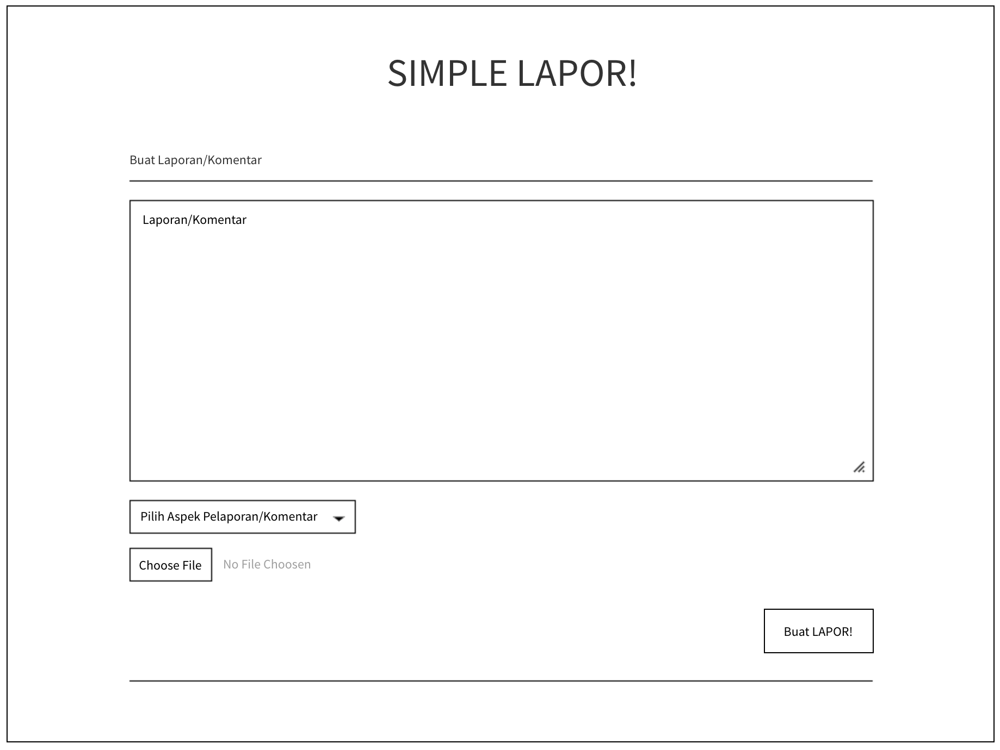
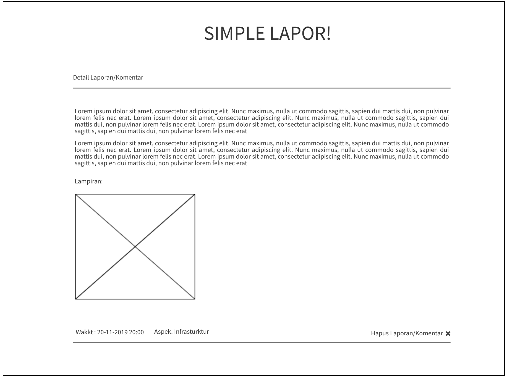

## Simple `LAPOR` :heavy_exclamation_mark:
Anda mengetahui aplikasi `lapor` yang dibuat oleh pemerintah republik indonesia? jika tidak silahkan kunjungi 
http://lapor.go.id, maka anda akan mendapatkan laman seperti gambar di bawah

Kali ini kita akan membuat aplikasi web seperti `lapor` untuk mengumpulkan laporan/komentar terkait layanan
di program studi teknik informatika ITERA.
**Luangkan waktu untuk membaca spesifikasi ini sampai selesai.** :kissing_heart:

### Anggota Tim :cyclone:
Project dikerjakan secara **berkelompok** dengan maksimal jumlah anggota adalah 2-3 orang mahasiswa.

### Petunjuk Pengerjaan :umbrella:
1. Fork pada repository ini dengan akun github anda.
2. Silakan commit pada repository anda (hasil fork). Lakukan berberapa commit dengan pesan yang bermakna,
contoh: fix css, membuat post done, jangan seperti final, benerin dikit, oke deh, update deh dll. 
Disarankan untuk tidak melakukan commit dengan perubahan yang besar karena akan mempengaruhi 
penilaian (contoh: hanya melakukan satu commit kemudian dikumpulkan).
3. Ubah **Penjelasan Teknis** pada bagian bawah readme.md ini dengan menjelaskan bagaimana cara anda:
   - Instalasi Framework, Koneksi basis data 
   - Melakukan validasi pada client-side
   - Melakukan AJAX (mulai dari pengguna melakukan klik pada tombol LAPOR! sampai laporan/komentar terkirim).
4. Pull request dari repository anda ke repository ini dengan 
format **NIM** - **Nama Lengkap**. **Waktu terkahir proses pull request adalah 4 hari setelah 
ujian akhir semester (UAS)**
5. Data yang dikumpulkan adalah:
   - Source code aplikasi
   - Basis data, dan
   - Cara instalasi aplikasi anda
6. Penilaian:
   - Kerjasama tim
   - Kesesuaian dengan spesifikasi
   - Pemahaman dalam penggunaan framework
   - Antarmuka aplikasi
   - Bug free :beetle:
   
### Tools :hammer:
1. Untuk backend, wajib menggunakan PHP framework apapun (Contoh: Codeigniter, Laravel, Slim, Yii dll).
2. Gunakan MySQL atau basis data relasional lain untuk menyimpan data.
3. Untuk frontend, gunakan Javascript, HTML dan CSS. **Tidak boleh menggunakan library atau framework CSS atau JS seperti 
JQuery atau Bootstrap.** CSS sebisa mungkin ada di file yang berbeda (tidak inline styling/embeding styling).

### Spesifikasi Simple LAPOR!
#### Tampilan :soccer:
Anda diminta untuk membuat tampilan sedemikian hingga mirip dengan tampilan berikut. Website yang diminta tidak harus 
responsive. Desain tampilan tidak perlu dibuat indah. Icon dan jenis font tidak harus sama dengan contoh. Warna font, 
garis pemisah, dan perbedaan ukuran font harus terlihat sesuai contoh. Perhatikan juga tata letak elemen-elemen.

- Search bar diletakkan di bagian paling atas dibawah judul.
- Tombol "cari" berada di sebelah kanan search bar.
- **Buat LAPOR!** digunakan untuk mengirimkan laporan/komentar baru.
- Tampilan search bar ini harus tetap ada walaupun anda tidak mengimplementasikan fitur search.
- Tampilan pertanyaan tidak harus urut berdasarkan "Laporan/Komentar terakhir", 
namun tulisan "Laporan/komentar Terakhir" ini harus ada.

- Tampilan di atas digunakan untuk mengajukan atau mengubah laporan/komentar.
- Perhatikan label dari field pada form berada di dalam field (tidak di luar)
- Apek yang dilaporkan ditampilkan dalam bentuk `select`

- Bagian ini menampilkan laporan/komentar. Bagian `datetime` harus ada. Tanda `kuote` tidak harus ada
- Perhatikan label dari field pada form berada di dalam field (tidak di luar)

### List laporan/komentar
Halaman utama berisi daftar judul pertanyaan, siapa yang bertanya, dan isi pertanyaan. Isi pertanyaan yang terlalu 
panjang harus dipotong. Silakan definisikan sendiri seberapa panjang agar tetap baik terlihat di layout yang Anda buat.

Pada masing-masing elemen list, terdapat menu untuk mengubah dan menghapus pertanyaan.

### Kirim laporan/komentar `LAPOR!`
Pengguna dapat mengajukan laporan/komentar. Form yang digunakan memiliki komentar (textarea), 
data lapiran berupa gambar 
dan file berekstention `doc, docx, xls, xlsx, ppt, pptx, pdf``. Gunakan HTTP POST.

### Ubah Laporan/komentar
Pengguna dapat mengubah laporan/komentar yang sudah dibuat. Form yang digunakan memiliki tampilan yang sama dengan 
form untuk bertanya, namun field-field yang ada sudah terisi. Gunakan HTTP POST untuk menyimpan perubahan.

### Hapus Laporan/komentar
Pengguna dapat menghapus laporan/komentar yang sudah dibuat. Lakukan konfirmasi penghapusan dengan `javascript`.

### Lihat Laporan/komentar
Pengguna dapat melihat laporan/komentar. Pada halaman ini terdapat informasi aspek yang dilaporkan.
(Dosen, Staff, Mahasiswa, Infrastruktur dan Pengajaran ), isi laporan/komentar, waktu pengiriman komentar `datetime` 
dan file lapiran. 

### Validasi
Validasi **wajib** dilakukan pada *client-side*, dengan menggunakan **javascript** bukan HTML 5 input type, yaitu:
- Setiap field pada form tidak boleh kosong.
- minimal jumlah kata dalam laporan/komentar adalah 20 kata.

### Bonus
Pengguna dapat mencari laporan/komentar dengan melakukan search ke `isi laporan/komentar`.

### Penjelasan Teknis
1. Instalasi Framework
dalam tugas besar ini kami menggunakan framework CodeIgniter, 
-langkah pertama kunjungi halaman CodeIgniter lalu download sesuai versi yang diinginkan, disini kami menggunakan versi 3.0
-jika sudah di download, ekstrak CodeIgniter-3.0.*.zip menggunakan WinRAR atau 7Zip kedalam folder htdocs jika Kamu menggunakan XAMPP atau /var/www/html. jika Kamu menggunakan Apache2 Standalone, setelah itu ubahlan nama foldernya menjadi IF3111-1920.
-sekarang silahkan coba akses URL http://localhost/IF3111-1920/ melalui browser, akan langsung ditampilkan halaman awal Codeigniter yang berarti Instalasi telah berhasil.

2. Koneksi Basis data
-buka CodeIgneter, lalu klik application->config->database.php
-lalu buka database.php, setelah itu ketikkan sesuai nama database yang kita buat.
-contohnya:
$db['default'] = array(
	'dsn'	=> '',
	'hostname' => 'localhost',
	'username' => 'root',
	'password' => '',
	'database' => 'tubes',
	'dbdriver' => 'mysqli',
	'dbprefix' => '',
	'pconnect' => FALSE,
	'db_debug' => (ENVIRONMENT !== 'production'),
	'cache_on' => FALSE,
	'cachedir' => '',
	'char_set' => 'utf8',
	'dbcollat' => 'utf8_general_ci',
	'swap_pre' => '',
	'encrypt' => FALSE,
	'compress' => FALSE,
	'stricton' => FALSE,
	'failover' => array(),
	'save_queries' => TRUE
);

3. Melakukan validasi pada client-side
-Input data field 
-Data akan di proses menggunakan Ajax (Ajax mengirim ke Server Side)
-Server Side akan cek data, apakah kosong ? duplikat data ? Angaka atau huruf ? Minimal dan Maksimal karakter ?
-Jika cek Validasi Server Side berhasil, Server Side akan konfirmasi ke Ajax dan Ajax menampilakan pesan berhasil
-Jika cek Validasi Server Side gagal, Server Side akan konfirmasi ke Ajax berupa input field tidak memenuhi syarat, dan Ajax menampilkan pesan syarat yang harus dipenuhi.

4. Melakukan AJAX (mulai dari pengguna melakukan klik pada tombol LAPOR! sampai laporan/komentar terkirim).
-jika ingin membuat laporan klik "buat laporan", lalu masukkan keluhan anda, pilih aspek, klik choose file untuk memasukkan file, selanjutnya klik tombol tambah data untuk submit.
-laporan akan muncul secara otomatis ketika kita menambahkan laporan/komentar.
-dihalaman home dapat melihat laporan yang sudah dikirim dengan mengklik "lihat selengkapnya".
-jika ingin mencari laporan dengan kata kunci, ketikkan kata yang mau dicari lalu klik Cari.

### Knowledge
Untuk meringankan beban tugas ini, ada berberapa keyword yang bisa anda cari untuk menyelesaikan tugas ini.
- CSS: margin, padding, header tag, font-size, text-align, float, clear, border, color, div, span, placeholder, 
anchor tag.
- Javascript : XMLHTTPRequest.
- PHP Framework : [Codeigniter](https://codeigniter.com/en/docs), [Laravel](https://laravel.com/docs/6.x) dll.
- SQL query: SELECT, INSERT, UPDATE, DELETE, WHERE, operator LIKE.

:telephone: Jika ada pertanyaan silakan tanyakan lewat `Asisten`.

### About :honeybee:

Dosen       : Rajif Agung Yunmar, S.Kom., M.Cs.	,Ahmad Luky Ramdani, S.Komp., M.Kom. ,
Arief Ichwani, S.Kom., M.Cs., Andre Febrianto, S.Kom., M.Eng, Ilham Firman Ashari, S.Kom., M.T

