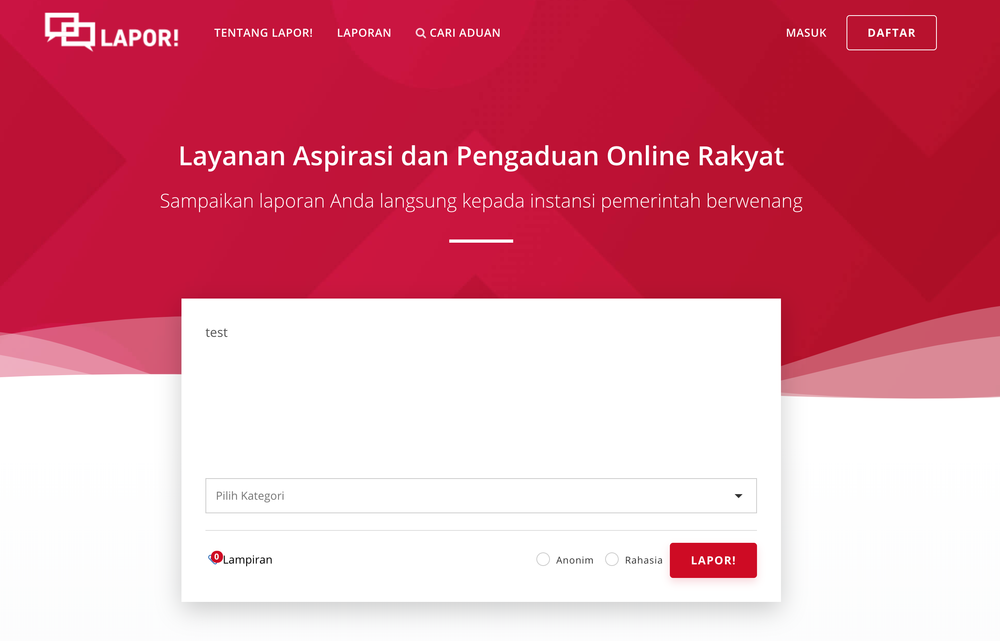
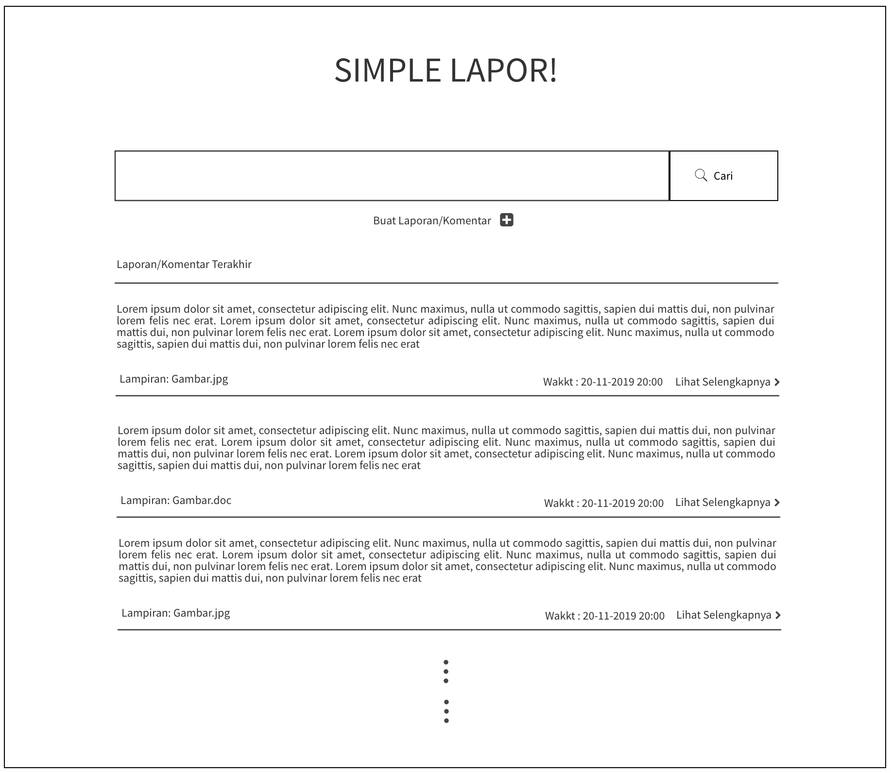

## Simple `LAPOR` :heavy_exclamation_mark:
Anda mengetahui aplikasi `lapor` yang dibuat oleh pemerintah republik indonesia? jika tidak silahkan kunjungi 
http://lapor.go.id, maka anda akan mendapatkan laman seperti gambar di bawah

Kali ini kita akan membuat aplikasi web seperti `lapor` untuk mengumpulkan laporan/komentar terkait layanan
di program studi teknik informatika ITERA.
**Luangkan waktu untuk membaca spesifikasi ini sampai selesai.** :kissing_heart:

### Anggota Tim :cyclone:
Project dikerjakan secara **berkelompok** dengan maksimal jumlah anggota adalah 2-3 orang mahasiswa.
Anggota kelompok :
Robby Legitra K. - 14117101
Yusuf Firmansyah W. P. - 1411609
Angelica Kirana Sandra Dewi - 14117008

### Petunjuk Pengerjaan :umbrella:
1. Fork pada repository ini dengan akun github anda.
2. Silakan commit pada repository anda (hasil fork). Lakukan berberapa commit dengan pesan yang bermakna,
contoh: fix css, membuat post done, jangan seperti final, benerin dikit, oke deh, update deh dll. 
Disarankan untuk tidak melakukan commit dengan perubahan yang besar karena akan mempengaruhi 
penilaian (contoh: hanya melakukan satu commit kemudian dikumpulkan).
3. Ubah **Penjelasan Teknis** pada bagian bawah readme.md ini dengan menjelaskan bagaimana cara anda:
   - Instalasi Framework, Koneksi basis data 
   - Melakukan validasi pada client-side
   - Melakukan AJAX (mulai dari pengguna melakukan klik pada tombol LAPOR! sampai laporan/komentar terkirim).
4. Pull request dari repository anda ke repository ini dengan 
format **NIM** - **Nama Lengkap**. **Waktu terkahir proses pull request adalah 4 hari setelah 
ujian akhir semester (UAS)**
5. Data yang dikumpulkan adalah:
   - Source code aplikasi
   - Basis data, dan
   - Cara instalasi aplikasi anda
6. Penilaian:
   - Kerjasama tim
   - Kesesuaian dengan spesifikasi
   - Pemahaman dalam penggunaan framework
   - Antarmuka aplikasi
   - Bug free :beetle:
   
### Tools :hammer:
1. Untuk backend, wajib menggunakan PHP framework apapun (Contoh: Codeigniter, Laravel, Slim, Yii dll).
2. Gunakan MySQL atau basis data relasional lain untuk menyimpan data.
3. Untuk frontend, gunakan Javascript, HTML dan CSS. **Tidak boleh menggunakan library atau framework CSS atau JS seperti 
JQuery atau Bootstrap.** CSS sebisa mungkin ada di file yang berbeda (tidak inline styling/embeding styling).

### Spesifikasi Simple LAPOR!
#### Tampilan :soccer:
Anda diminta untuk membuat tampilan sedemikian hingga mirip dengan tampilan berikut. Website yang diminta tidak harus 
responsive. Desain tampilan tidak perlu dibuat indah. Icon dan jenis font tidak harus sama dengan contoh. Warna font, 
garis pemisah, dan perbedaan ukuran font harus terlihat sesuai contoh. Perhatikan juga tata letak elemen-elemen.

- Search bar diletakkan di bagian paling atas dibawah judul.
- Tombol "cari" berada di sebelah kanan search bar.
- **Buat LAPOR!** digunakan untuk mengirimkan laporan/komentar baru.
- Tampilan search bar ini harus tetap ada walaupun anda tidak mengimplementasikan fitur search.
- Tampilan pertanyaan tidak harus urut berdasarkan "Laporan/Komentar terakhir", 
namun tulisan "Laporan/komentar Terakhir" ini harus ada.

- Tampilan di atas digunakan untuk mengajukan atau mengubah laporan/komentar.
- Perhatikan label dari field pada form berada di dalam field (tidak di luar)
- Apek yang dilaporkan ditampilkan dalam bentuk `select`

- Bagian ini menampilkan laporan/komentar. Bagian `datetime` harus ada. Tanda `kuote` tidak harus ada
- Perhatikan label dari field pada form berada di dalam field (tidak di luar)

### List laporan/komentar
Halaman utama berisi daftar judul pertanyaan, siapa yang bertanya, dan isi pertanyaan. Isi pertanyaan yang terlalu 
panjang harus dipotong. Silakan definisikan sendiri seberapa panjang agar tetap baik terlihat di layout yang Anda buat.

Pada masing-masing elemen list, terdapat menu untuk mengubah dan menghapus pertanyaan.

### Kirim laporan/komentar `LAPOR!`
Pengguna dapat mengajukan laporan/komentar. Form yang digunakan memiliki komentar (textarea), 
data lapiran berupa gambar 
dan file berekstention `doc, docx, xls, xlsx, ppt, pptx, pdf``. Gunakan HTTP POST.

### Ubah Laporan/komentar
Pengguna dapat mengubah laporan/komentar yang sudah dibuat. Form yang digunakan memiliki tampilan yang sama dengan 
form untuk bertanya, namun field-field yang ada sudah terisi. Gunakan HTTP POST untuk menyimpan perubahan.

### Hapus Laporan/komentar
Pengguna dapat menghapus laporan/komentar yang sudah dibuat. Lakukan konfirmasi penghapusan dengan `javascript`.

### Lihat Laporan/komentar
Pengguna dapat melihat laporan/komentar. Pada halaman ini terdapat informasi aspek yang dilaporkan.
(Dosen, Staff, Mahasiswa, Infrastruktur dan Pengajaran ), isi laporan/komentar, waktu pengiriman komentar `datetime` 
dan file lapiran. 

### Validasi
Validasi **wajib** dilakukan pada *client-side*, dengan menggunakan **javascript** bukan HTML 5 input type, yaitu:
- Setiap field pada form tidak boleh kosong.
- minimal jumlah kata dalam laporan/komentar adalah 20 kata.

### Bonus
Pengguna dapat mencari laporan/komentar dengan melakukan search ke `isi laporan/komentar`.

### Penjelasan Teknis
Pengembangan website ini dilakukan dengan menggunakan framework CodeIgniter dikarenakakn penggunaan CI yang mudah dipelajari dan cukup ringan.

Cara untuk memasang CI yaitu:

    1. Buka web browser lalu kunjungi situs https://codeigniter.com/ dan mengunduh The latest is Version 3.1.11
    2. Kemudian ekstrak file yang telah diunduh lalu pindahkan file ke dalam folder htdocx, hidupkan apache dan MsySQL supaya PHP dapat dijalankan.
    gunakan text editor untuk mengembangkan website

Cara mengoneksikan CodeIgniter terhadap localhost yaitu :

    Buka folder Application -> Config -> config.php
    Ubah base url menjadi $config['base_url'] = 'http://localhost/CodeIgniter/';
    akses loocalhost dengan menghidupkan apache pada XAMPP
    kunjungi $config['base_url'] = 'http://localhost/CodeIgniter/'; ,maka akan muncul pesan welcome dan CodeIgniter telah terpasang dengan baik.

Cara menghubungkan CodeIgniter dengan database yaitu sebagai berikut : database berada pada folder CodeIgniter

    mengaktifkan modul yang bernama database pada folder Application -> Config -> database.php 'hostname' => 'localhost', 'username' => 'root', 'password' => '', 'database' => 'lapor',

Untuk masuk ke tampilan awal : http://localhost/IF3111-1920/beranda

Tampilan yang ada :
    1. Halaman awal untuk guest
    2. List Laporan
    3. Halaman awal admin
    4. Pengaturan Akun    

Form validation untuk membuat laporan lakukan sebagai berikut :

    1. Pengguna harus mendaftarkan diri terlebih dahulu sebelum membuat laporan
    2. Setelah mendaftarkan diri, akun pendaftar akan terlebih dahulu divalidasi oleh admin
    3. Admin login untuk mengaktivasi akun dari pendaftar
    4. Setelah akun pendaftar di aktivasi, pendaftar login untuk membuat laporan
    5. Setelah masuk akan terdapat halaman awal buat pengguna
    6. Pengguna dapat melihat daftar laporan dan juga dapat membuat laporan

    Note : akun pengguna yang telah diaktivasi
        1. username : 14116097 password : 14116097

field deskripsi adalah kolom untuk menampung laporan dimana rules yang diterapkan yaitu required berarti dibutuhkan untuk mengisi, dan minimum isi adalah 20 character

kemudain file aspek juga perlu diisi, dan yang terakhir adalah field berkas, dimana wajib diisi dan memiliki ketentuan file yang boleh dimasukkan yaitu <= 8192 KB.

$config['allowed_types']	= 'gif|jpeg|jpg|png|pdf|docx|doc|GIF|JPEG|JPG|PNG|DOCX|DOC|PDF';
		$config['max_size'] 			= '8192';
		$config['upload_path'] 		= './assets/lampiran';

    $this->load->library('upload',$config);

    if (!$this->upload->do_upload('berkas')) {
      echo "Gagal Menggunggah Lampiran!"; die();
    } else {
      $gambar = $this->upload->data('file_name');
    }

    $data = array(
                    'nim' => $nim,
                    'aspek' => $aspek,
                    'cp' => $cp,
                    'hal' => $hal,
                    'status' => $status,
                    'lampiran' => $lampiran
                 );
    $this->db->insert('laporan', $data);
  }

### Knowledge
Untuk meringankan beban tugas ini, ada berberapa keyword yang bisa anda cari untuk menyelesaikan tugas ini.
- CSS: margin, padding, header tag, font-size, text-align, float, clear, border, color, div, span, placeholder, 
anchor tag.
- Javascript : XMLHTTPRequest.
- PHP Framework : [Codeigniter](https://codeigniter.com/en/docs), [Laravel](https://laravel.com/docs/6.x) dll.
- SQL query: SELECT, INSERT, UPDATE, DELETE, WHERE, operator LIKE.

:telephone: Jika ada pertanyaan silakan tanyakan lewat `Asisten`.

### About :honeybee:

Dosen       : Rajif Agung Yunmar, S.Kom., M.Cs.	,Ahmad Luky Ramdani, S.Komp., M.Kom. ,
Arief Ichwani, S.Kom., M.Cs., Andre Febrianto, S.Kom., M.Eng, Ilham Firman Ashari, S.Kom., M.T

