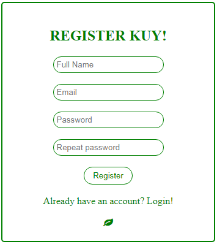

## `SIMPLE LAPOR`

### **Anggota Tim :cyclone:**
- **Habib Abdurrasyid** 
- **Dhiko jangjaya Putra**

### **Penjelasan Teknis**
**Instalasi Framework  Codeigniter 3.1**
   - Mendownload Framework CI
   - Melakukan konfigurasi dasar Codeigniter pada folder config
   - Perancangan Roadmap Aplikasi
   - Coding
   
**Melakukan validasi pada client-side**
   - Melakukan Validasi form menggunakan native Javascript

  
### **Spesifikasi Simple LAPOR!**
  - Framework     : Codeigniter 3.1
  - DBMS          : mysql
  - Language      : PHP, Javascript (Native)
  - Fitur         : CRUD laporan / komentar, Validasi form, Search komentar

- Tampilan di atas digunakan untuk mengajukan atau mengubah laporan/komentar.
- Ekstensi file upload:`doc, docx, xls, xlsx, ppt, pptx, pdf`

- Bagian ini menampilkan laporan/komentar
- terdapat menu untuk mengubah dan menghapus pertanyaan.

### List laporan/komentar

  - list laporan/komentar

### Ubah Laporan/komentar

  - halaman ubah laporan/komentar

### Cara Instalasi
  - Clone / Download Repository ke komputer local, letakkan di folder server XAMPP / WAMP / LAMP
  - Import Database, beri nama "lapor" tanpa tanda petik
  - setting base_url sesuai dengan folder server local
  - Enjoy!

### Big Thanks
  - Dosen Pengampu Pemrograman WEB
  - Channel Web Programming Unpas on Youtube

Dosen       : Rajif Agung Yunmar, S.Kom., M.Cs.	,Ahmad Luky Ramdani, S.Komp., M.Kom. ,
Arief Ichwani, S.Kom., M.Cs., Andre Febrianto, S.Kom., M.Eng, Ilham Firman Ashari, S.Kom., M.T

